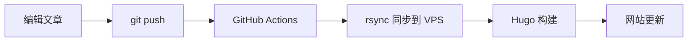

# TokenFree

> 汇聚全球 AI Token 资源，让开发者自由调用

🌐 **网站**: [https://tokenfree.news](https://tokenfree.news)

## 关于 TokenFree

TokenFree 是一个致力于整理和分享全球免费/低成本 AI API Token 渠道的信息平台。无论你是个人开发者还是团队，都能在这里找到合适的 AI 接口资源。

## 内容导航

### 📰 文章资讯
- 最新 AI 行业动态
- API 平台更新公告
- 使用技巧与教程

### 🔑 Token 渠道
| 提供商 | 模型 | 状态 |
|--------|------|------|
| [OpenRouter](https://tokenfree.news/resources/openrouter/) | 多模型聚合 | ✅ |
| [SiliconFlow](https://tokenfree.news/resources/siliconflow/) | 中文模型 | ✅ |
| [Groq](https://tokenfree.news/resources/groq/) | Llama 系列 | ✅ |
| [Google Gemini](https://tokenfree.news/resources/google-gemini/) | Gemini 系列 | ✅ |
| [Cerebras](https://tokenfree.news/resources/cerebras/) | 推理加速 | ✅ |
| [Mistral](https://tokenfree.news/resources/mistral/) | Mistral 系列 | ✅ |
| [BigModel GLM](https://tokenfree.news/resources/bigmodel-glm/) | 智谱 GLM | ✅ |
| [NVIDIA NIM](https://tokenfree.news/resources/nvidia-nim/) | NVIDIA 模型 | ✅ |
| [Cloudflare Workers AI](https://tokenfree.news/resources/cloudflare-workers-ai/) | 边缘推理 | ✅ |

## 技术架构

- **静态生成**: [Hugo](https://gohugo.io/) + [PaperMod](https://github.com/adityatelange/hugo-PaperMod) 主题
- **部署方式**: GitHub Actions → VPS 自动部署
- **Web 服务器**: Caddy (Docker)
- **域名**: [tokenfree.news](https://tokenfree.news)

## 目录结构

```
content/
├── _index.md           # 首页
├── search.md           # 搜索页面
├── posts/              # 文章/资讯
│   ├── _index.md
│   └── *.md
└── tokens/             # API Token 渠道
    ├── _index.md
    └── *.md
```

## 自动部署流程



1. 编辑 `content/` 目录下的 Markdown 文件
2. `git add . && git commit -m "xxx" && git push`
3. GitHub Actions 自动触发部署
4. 约 13 秒后网站自动更新

## 本地开发

如需本地预览，需要 Hugo Extended 版本：

```bash
# 克隆仓库
git clone git@github.com:Tokenfree216/tokenfree.git
cd tokenfree

# 安装 Hugo (macOS)
brew install hugo

# 启动开发服务器
hugo server -D
```

## 贡献指南

欢迎提交 PR 补充新的 Token 渠道或更新现有信息！

### 添加新 Token 渠道

在 `content/resources/` 目录下创建新的 `.md` 文件，格式如下：

```yaml
---
title: "渠道名称"
date: 2026-09-10T00:00:00+08:00
provider: "提供商名"
api_base: "https://api.example.com/v1"
model: "支持的模型"
signup: "https://example.com/signup"
weight: 1
expired: false
---

## 简介

简要介绍该渠道的特点和优势。

## 使用方法

```bash
curl https://api.example.com/v1/chat/completions \
  -H "Authorization: Bearer YOUR_TOKEN" \
  -H "Content-Type: application/json" \
  -d \x27{
    "model": "model-name",
    "messages": [{"role": "user", "content": "Hello"}]
  }\x27
```

## 额度说明

- 免费额度：xxx
- 速率限制：xxx
```

## 联系方式

- 📧 邮箱: tokenfree@126.com
- 🐙 GitHub: [Tokenfree216](https://github.com/Tokenfree216)

---

*Built with ❤️ by TokenFree Team*
